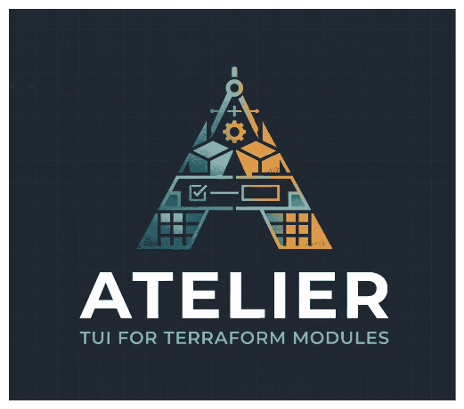

# Atelier



A provider-agnostic terminal UI for configuring Terraform modules.

Atelier works with **any** Terraform provider — AWS, GCP, Azure, Juju, or
anything else with a Terraform provider. It treats a module's variables as
its API surface. The wrapper it generates captures only the values the
deployer chose to set, so `main.tf` reads as a concise statement of intent
rather than a wall of options. Defaults handle the rest, and plan diffs show exactly what changes between versions — making large modules approachable for first-time and experienced Terraform users alike.

## Quick start

```bash
# Any public git repo containing Terraform modules works:
atelier init https://github.com/terraform-aws-modules/terraform-aws-vpc.git
atelier init https://github.com/canonical/observability-stack.git

# Already have a Terraform project with a module block? Adopt it:
cd my-existing-terraform-project/
atelier init

# Re-open an existing wrapper:
atelier
```

## Keyboard shortcuts

| Key | Context | Action |
|-----|---------|--------|
| `Tab` | Anywhere | Switch between left (variable list) and right (editor) pane |
| `↑` / `↓` | Left pane | Navigate variables |
| `Enter` | Left pane | Focus the editor for the selected variable |
| `P` | Left pane | Run `terraform plan` against the wrapper |
| `A` | Plan view | Apply the current plan |
| `O` | Plan view | Show terraform outputs (planned values or state) |
| `R` | Left pane | Switch the module ref (branch, tag, or SHA) |
| `E` | Left pane | Show full error detail (when an error is present) |
| `F` | Left pane | Open the preset picker (when presets are available) |
| `?` | Anywhere | Show the keyboard shortcuts help modal |
| `^R` | Anywhere | Reset the current variable to its default |
| `Q` | Left pane | Quit and save |

### Editing a value

The right-pane editors (string, number, and map cells) use a readline-style
keymap so editing works like `bash`, `zsh`, or any standard text input
field. See [ADR-0020](docs/adr/0020-readline-style-text-editing.md) for the
rationale.

| Key | Action |
|-----|--------|
| `←` / `→` | Move caret one character |
| `Ctrl+←` / `Ctrl+→` | Move caret one word |
| `Alt+B` / `Alt+F` | Move caret one word (Emacs-style alias) |
| `Home` / `Ctrl+A` | Caret to start of cell |
| `End` / `Ctrl+E` | Caret to end of cell |
| `Backspace` | Delete the character before the caret |
| `Delete` | Delete the character under the caret |
| `Ctrl+W` / `Alt+Backspace` | Delete the previous word |
| `Alt+D` | Delete the next word |
| `Ctrl+U` | Delete from caret to start |
| `Ctrl+K` | Delete from caret to end |

Sensitive variables (`sensitive = true`) echo `•` characters; the keymap is
unchanged.

### Map / map(object) editors

| Key | Action |
|-----|--------|
| `Tab` / `Shift+Tab` | Cycle cells (key → value → next row's key …) |
| `↑` / `↓` | Move between rows |
| `Enter` | Add a new row (when the cursor is on the `+ Add row` line) |
| `Alt+Delete` | Remove the current row |
| `Ctrl+Home` / `Ctrl+End` | Jump to the first / last field (inside an object editor) |

### Output view

| Key | Action |
|-----|--------|
| `j` / `↓` | Scroll down |
| `k` / `↑` | Scroll up |
| `Ctrl+D` / `PgDn` | Half-page down |
| `Ctrl+U` / `PgUp` | Half-page up |
| `g` | Jump to top |
| `G` | Jump to bottom |
| `Esc` / `q` | Close |

## Presets

Module maintainers can declare **presets** in `atelier.yaml` — named bundles
of variable values that users apply in one action, then customise as needed.

```yaml
modules:
  - path: terraform/cos-lite
    name: "COS Lite"
    presets:
      - name: production
        description: "Stable channel, TLS, HA replicas."
        sets:
          risk: "stable"
          internal_tls: true
          alertmanager:
            units: 3
```

When presets are declared, `[F] preset` appears in the status bar. Press `F`
to open the picker, navigate with `↑`/`↓`, apply with `Enter`, or cancel
with `Esc`.

See [docs/examples/cos-lite.atelier.yaml](docs/examples/cos-lite.atelier.yaml)
for a full example.

## Comparing versions

Press `R` to switch the module ref without leaving the TUI. Atelier
re-clones the module, carries your values forward, runs
`terraform init -upgrade`, and flags any orphaned or newly required
variables.

1. Configure and plan at `v1.0`.
2. Press `R`, type `v2.0`, confirm.
3. Plan again — the diff shows what the version bump changes.

## Tidying a wrapper

Atelier writes sparse `main.tf` files — only values that differ from the
module's defaults appear (see [ADR-0007](docs/adr/0007-sparse-wrapper-write-rule.md)).
But a wrapper that was hand-authored, adopted with `atelier init`, or
seeded from an upstream example often carries arguments set to their default
value, which is just noise:

```hcl
module "cos_lite" {
  source  = "git::https://github.com/canonical/observability-stack.git//terraform/cos-lite?ref=main"
  model   = { name = "cos-lite-two" }
  grafana = { units = 1 }          # 1 is already the default
  catalogue = { app_name = "catalogue" }  # also the default
}
```

`atelier tidy` prunes those redundant arguments back to sparse form:

```bash
atelier tidy            # dry run: print the diff, change nothing
atelier tidy --write    # apply it (backs up main.tf first)
```

It is **dry-run by default**. With `--write` it copies the current `main.tf`
to `.atelier/backups/main.tf.<timestamp>.bak` before rewriting. Tidy reuses
the same writer the TUI uses, so the change is apply-neutral: `terraform plan`
is identical before and after (a value equal to the default and an unset value
mean the same thing to Terraform). It refuses to run when it can't fetch the
module schema (it won't guess defaults) or when `main.tf` has more than one
module block, and it warns when the module ref isn't pinned to a commit
(defaults can move under an unpinned branch). Arguments whose value is an
expression (`var.x`, `module.y.z`) are never pruned.

See [ADR-0021](docs/adr/0021-tidy-command.md) for the design.

## Validate on save

Every time you edit a variable, Atelier debounces a background
`terraform validate`. Errors appear inline in the status bar; press `E` to
see full diagnostics. Validation runs `terraform init` automatically if the
workspace hasn't been initialised yet.

## Outputs

Press `O` in plan view to inspect module outputs. Before apply, Atelier
shows the planned output values from the plan file. After apply, it fetches
live values from state. The output view is scrollable — use `j`/`k` or
`PgUp`/`PgDn` to navigate large outputs.

Atelier generates an `outputs.tf` in the wrapper that forwards all of the
module's declared outputs:

```hcl
output "offers" {
  value = module.cos_lite.offers
}
```

## Troubleshooting

Atelier persists terraform's diagnostics under the wrapper's
`.atelier/logs/` directory (gitignored, regenerable):

- `tf-stderr.log` — terraform's stderr, appended across runs. Always on. It
  stays small because successful commands write little to stderr, so it
  mostly captures the warnings and errors worth keeping. This is the first
  place to look after an intermittent `plan`/`apply` failure.
- `tf-trace.log` — terraform's full `TRACE` log, written only when the
  `ATELIER_DEBUG` environment variable is set to a truthy value
  (`ATELIER_DEBUG=1 atelier`). It is verbose, so it is off by default; leave
  it enabled to capture the exact `git` commands terraform's module
  installer runs — useful for diagnosing flaky `terraform init` module
  fetches.

## Documentation

| Document | Description |
| --- | --- |
| [docs/SPEC.md](docs/SPEC.md) | v1 specification |
| [docs/ROADMAP.md](docs/ROADMAP.md) | v1 scope and deferred items |
| [docs/adr/](docs/adr/) | Architecture Decision Records |
| [docs/examples/](docs/examples/) | Sample manifests |