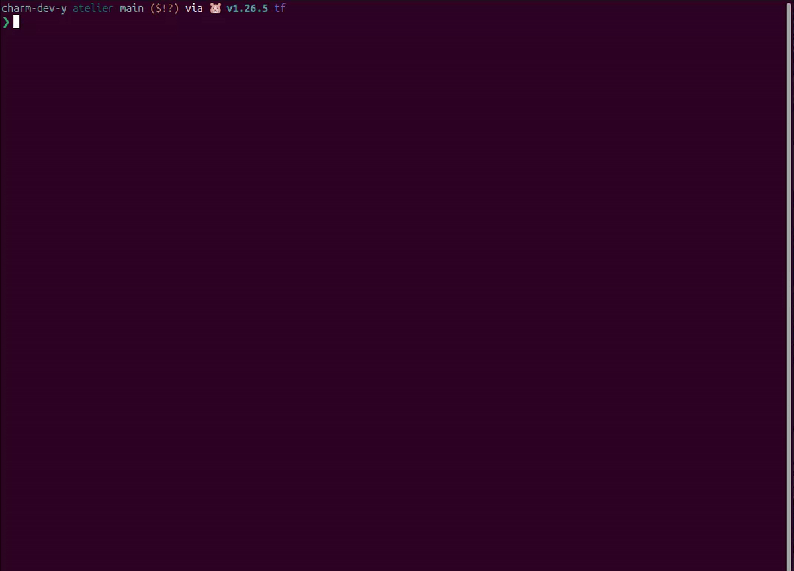
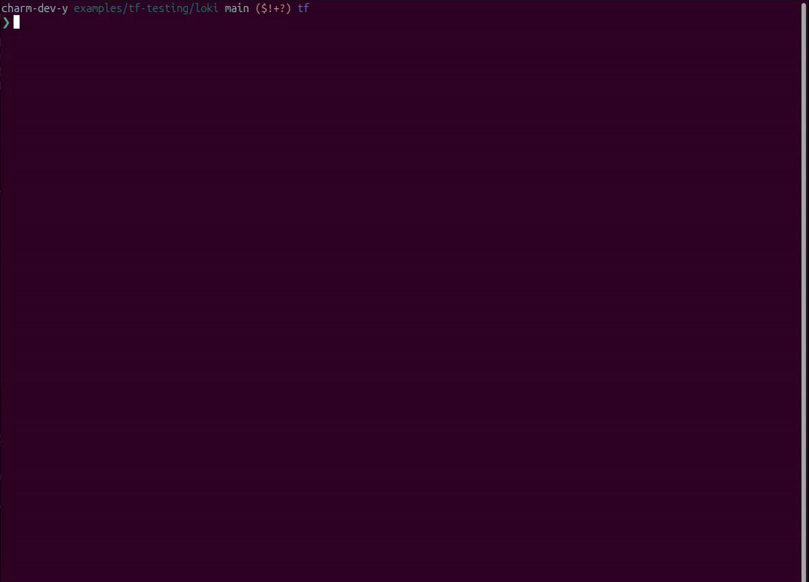
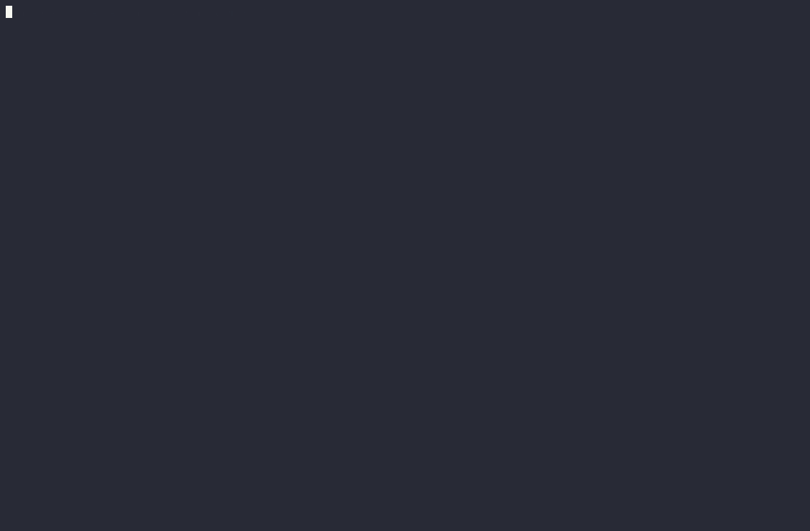
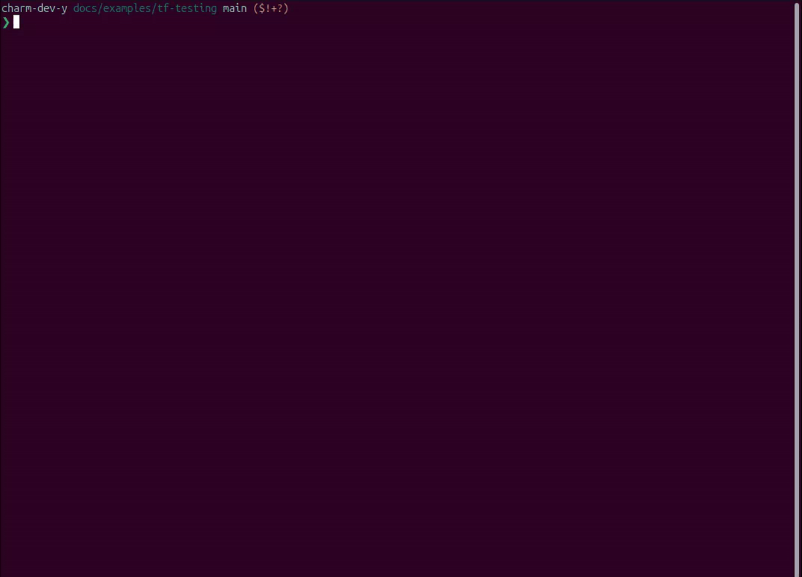
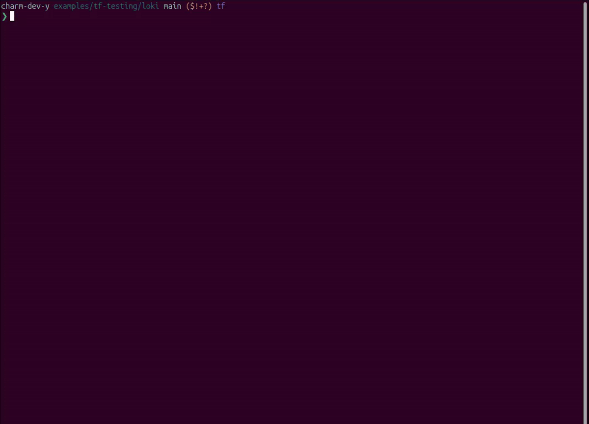
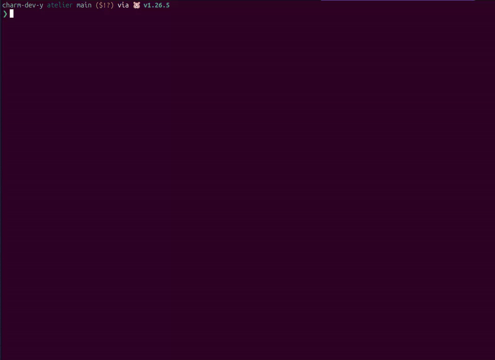

# Atelier

A provider-agnostic terminal UI for configuring Terraform modules.

It treats a module's variables as its API surface. The wrapper it generates
captures only the values the deployer chose to set, so `main.tf` reads as a
concise statement of intent rather than a wall of options. Defaults handle the
rest, and plan diffs show exactly what changes between versions — making large
modules approachable for first-time and experienced Terraform users alike.

## Design intent

- **Generic.** Works with any Terraform provider and any Terraform module
  that declares variables, not just Canonical products.
- **Wrapper-as-artifact.** The wrapper directory is the durable output. It is
  version-controllable, shareable, runnable without Atelier installed, and
  CI-compatible. Atelier's internal state lives in a `.atelier/` subdirectory
  that is regenerable from the wrapper.
- **Plan and apply in the TUI.** Atelier owns the configure → plan iteration
  loop and supports `terraform apply` from the plan view (`A` key). The
  wrapper remains independently runnable without Atelier installed.
- **User-owned presets.** Reusable variable bundles are `.tfvars` files in an
  `atelier.presets/` directory discovered by walking up from the wrapper
  directory, so one directory can be shared across sibling wrappers. Product
  repos can also commit examples under `<module>/examples/`. See
  [Presets](#presets).

## Requirements

- [Terraform](https://developer.hashicorp.com/terraform/install) (or OpenTofu)
  on your `PATH`.
- `git` on your `PATH` (Atelier shells out to it for cloning).

## Install

### Prebuilt binary (recommended)

Download the archive matching your OS and CPU, extract it, and move the
`atelier` binary onto your `PATH`:

```bash
VERSION=$(curl -sSf https://api.github.com/repos/MichaelThamm/atelier/releases/latest | grep '"tag_name"' | cut -d '"' -f 4) \
OS=linux \
ARCH=amd64 \
curl -sSfL \
  "https://github.com/MichaelThamm/atelier/releases/download/${VERSION}/atelier_${VERSION#v}_${OS}_${ARCH}.tar.gz" \
  | tar -xz atelier \
  && sudo install atelier /usr/local/bin/atelier
```

Builds are published for Linux, macOS, and Windows on amd64 and arm64;
`checksums.txt` accompanies each release.

### With Go

```bash
# Requires Go >= 1.25:
go install github.com/MichaelThamm/atelier/cmd/atelier@latest
```

## Quick start

Start a new wrapper from any public git repo containing Terraform modules.
`module add` bootstraps the wrapper on first use:

```bash
mkdir my-vpc && cd my-vpc
atelier module add https://github.com/terraform-aws-modules/terraform-aws-vpc.git
atelier module add https://github.com/canonical/observability-stack.git --module terraform/cos-lite
```

Re-open an existing wrapper (run with no arguments in the wrapper dir):
```bash
atelier
```

`module add` writes into the current directory, so it checks the directory first
and asks before scaffolding into one that already holds other files, sits inside
another wrapper, or looks like the root of a different project. Pass `--yes` to
skip the prompt in scripts; without a terminal the command fails rather than
proceeding.

> **Note:** run `atelier --help` for the full command list, including `atelier
> module add|rm|list`, `atelier tidy`, and `atelier purge`.

> **Note:** [loki-operators](https://github.com/canonical/loki-operators/tree/main/terraform)
> is used in the demos below since it encapsulates many of the intricacies of
> working with Terraform modules.

<details>
<summary>Demo: adding a module</summary>

1. `atelier module add https://github.com/canonical/loki-operators.git`
2. Inspect the module's API via its available variables



</details>

<details>
<summary>Demo: plan a module deployment</summary>

1. `atelier`
2. Press `[P]` to begin the plan
3. Investigate the Terraform state changes
4. Optionally press `[A]` to apply the state



</details>

## Validate on save

Every time you edit a variable, Atelier immediately saves the change to disk
and debounces a background `terraform validate`. Errors appear inline in the
status bar; press `L` to open the live logs view, whose Errors tab holds the
full terraform diagnostics. Validation runs `terraform init` automatically if
the workspace hasn't been initialised yet.

## Keyboard shortcuts

Atelier uses the terminal conventions you already know: `Tab` moves between
the variable list and the editor, `↑`/`↓` (or `j`/`k`) move the selection, and
`Enter` opens or advances. Value fields share one readline-style keymap
(`Ctrl+A`/`Ctrl+E`, `Ctrl+W`, `Alt+B`/`Alt+F`, …), so editing feels like
`bash`. Map editors follow a name-the-key-then-`Enter` model, and an empty key
is never saved.

Press `?` anywhere for the complete, always-current keymap. The help modal is
context-aware — it lists the keys for the view you are in (editor, plan, logs,
ref switch) and is the single source of truth for shortcuts. The demo GIFs in
this README show each flow end to end.

See [ADR-0020](docs/adr/0020-readline-style-text-editing.md),
[ADR-0023](docs/adr/0023-map-row-editing-lifecycle.md), and
[ADR-0025](docs/adr/0025-ref-selection-matcher.md) for the design rationale.

## Presets

A preset is a named `.tfvars` file: a bundle of variable values you apply in
one action, then customise. Atelier discovers presets from two sources:

- **Personal** bundles in an `atelier.presets/` directory at any ancestor of the
  wrapper, discovered by walking up (nearest wins). One shared directory at a
  parent (e.g. `tf-testing/atelier.presets/`) serves every wrapper beneath it.
- **Product** examples committed to the module repo, e.g.
  `terraform/cos/examples/s3.tfvars`.

Atelier reads only Terraform-native `.tfvars` files, and only when you name
them; it never reads Atelier-specific manifests. See
[ADR-0032](docs/adr/0032-upstream-tfvars-discovery.md).

The TUI lists both sources with `F` (source-labelled `[local]`/`[repo]`, with
the description taken from each file's leading comment); `Enter` applies the
selected one. Press `S` to save the current non-default configuration as a new
`atelier.presets/<name>.tfvars` in the wrapper directory.

### Applying a preset from the CLI

`atelier module add` accepts `--var-file`, which seeds a wrapper from one or
more bundles and exits without opening the TUI — useful in scripts and CI:

```bash
atelier module add https://github.com/canonical/observability-stack.git \
  --module terraform/cos --var-file s3,units --yes < /dev/null
```

Names resolve against your walk-up `atelier.presets/` bundles first, then the
module repo's examples; a local path is also accepted. `--list-var-files`
prints what is available. Piping stdin from `/dev/null` (or running without a
terminal) makes Atelier skip the TUI rather than error, so the command never
blocks.

<details>
<summary>Demo: saving a preset</summary>

1. `atelier`
2. Fill in all the required variables
3. Press `[S]` to save an `atelier.presets/<name>.tfvars` bundle



</details>

<details>
<summary>Demo: applying a preset</summary>

1. `atelier`
2. `[F]` to select and apply a bundle from a parent directory



</details>

## Comparing versions

Press `R` to switch the module ref without leaving the TUI. Atelier
re-clones the module, carries your values forward, runs
`terraform init -upgrade`, and flags any orphaned or newly required
variables.

The ref field filters the remote's branches and tags as you type
(case-insensitive substring match, prefix hits first), so a big repo's
50-plus refs narrow to the few you mean. The field is the same
readline-style cell as the value editors (see [ADR-0020](docs/adr/0020-readline-style-text-editing.md)),
so caret motion and word-delete work; free text (an arbitrary SHA, an
unlisted ref) is always accepted. See
[ADR-0025](docs/adr/0025-ref-selection-matcher.md) for the design.

Press `?` in the modal for its navigation keys.

<details>
<summary>Demo: switch module ref</summary>

1. `atelier`
2. `[R]` to browse module refs
3. Apply and inspect module changes with `[D]`



</details>

## Tidying a wrapper

Atelier writes sparse `main.tf` files — only values that differ from the
module's defaults appear (see [ADR-0007](docs/adr/0007-sparse-wrapper-write-rule.md)).
But a wrapper that was hand-authored or seeded from an upstream example often
carries arguments set to their default value, which is just noise:

```hcl
module "cos_lite" {
  source  = "git::https://github.com/canonical/observability-stack.git//terraform/cos-lite?ref=main"
  model   = { name = "cos-lite-two" }
  grafana = { units = 1 }          # 1 is already the default
  catalogue = { app_name = "catalogue" }  # also the default
}
```

`atelier tidy` prunes those redundant arguments back to sparse form:

```bash
atelier tidy            # dry run: print the diff, change nothing
atelier tidy --write    # apply it (backs up main.tf first)
```

It is **dry-run by default**. With `--write` it copies the current `main.tf`
to `.atelier/backups/main.tf.<timestamp>.bak` before rewriting. Tidy reuses
the same writer the TUI uses, so the change is apply-neutral: `terraform plan`
is identical before and after (a value equal to the default and an unset value
mean the same thing to Terraform). It refuses to run when it can't fetch the
module schema (it won't guess defaults) or when `main.tf` has more than one
module block, and it warns when the module ref isn't pinned to a commit
(defaults can move under an unpinned branch). Arguments whose value is an
expression (`var.x`, `module.y.z`) are never pruned.

See [ADR-0021](docs/adr/0021-tidy-command.md) for the design.

## Importing live infrastructure

`atelier import` reconstructs Terraform state for an existing module from a
running deployment. It discovers live resources via `terraform query`, matches
them to the module's resource addresses, and runs `terraform import` for each
match — a state-only operation that cannot change your infrastructure. Use
`--dry-run` to review what would be imported, and what the module would still
create, without touching state. See
[docs/how-to/import-juju.md](docs/how-to/import-juju.md) for a step-by-step Juju
walkthrough.

<details>
<summary>Demo: importing a live deployment</summary>

1. `atelier import`
2. `atelier`



</details>

## Troubleshooting

Atelier persists terraform's diagnostics under the wrapper's
`.atelier/logs/` directory (gitignored, regenerable):

- `tf-stderr.log` — terraform's stderr, appended across runs. Always on. It
  stays small because successful commands write little to stderr, so it
  mostly captures the warnings and errors worth keeping. This is the first
  place to look after an intermittent `plan`/`apply` failure.
- `tf-trace.log` — terraform's full `TRACE` log, written only when the
  `ATELIER_DEBUG` environment variable is set to a truthy value
  (`ATELIER_DEBUG=1 atelier`). It is verbose, so it is off by default; leave
  it enabled to capture the exact `git` commands terraform's module
  installer runs — useful for diagnosing flaky `terraform init` module
  fetches.

## Documentation

| Document | Description |
| --- | --- |
| [docs/SPEC.md](docs/SPEC.md) | Specification: surface, contracts, behaviours |
| [docs/ROADMAP.md](docs/ROADMAP.md) | What Atelier does today and what's not yet implemented |
| [docs/how-to/](docs/how-to/) | Step-by-step guides |
| [docs/adr/](docs/adr/) | Architecture Decision Records |
| [docs/examples/](docs/examples/) | Sample wrappers |

## Testing

Unit tests run with `go test ./...` (the `build · vet · test` job in
[`.github/workflows/ci.yml`](.github/workflows/ci.yml)).

Integration tests live in [`tests/integration/`](tests/integration/). A
wrapper-layer tier asserts the `atelier module add` surface (`--module`,
`--ref`, `--var-file`, `--as`, listing/removal) without a Juju model, and
`cloud`-marked tiers deploy real modules with Terraform:
[`canonical/prometheus-k8s-operator`](https://github.com/canonical/prometheus-k8s-operator)
as a deployment smoke test, and COS-Lite
([`canonical/observability-stack`](https://github.com/canonical/observability-stack))
as an import round-trip that deletes the Terraform state and proves
`atelier import` rebuilds it. They run in the
[`CI`](.github/workflows/ci.yml) workflow — after the `build · vet · test` job
passes — against Juju + Canonical K8s prepared by Concierge. See
[tests/integration/README.md](tests/integration/README.md) to run them locally.

## License

Apache-2.0. See [LICENSE](LICENSE).
