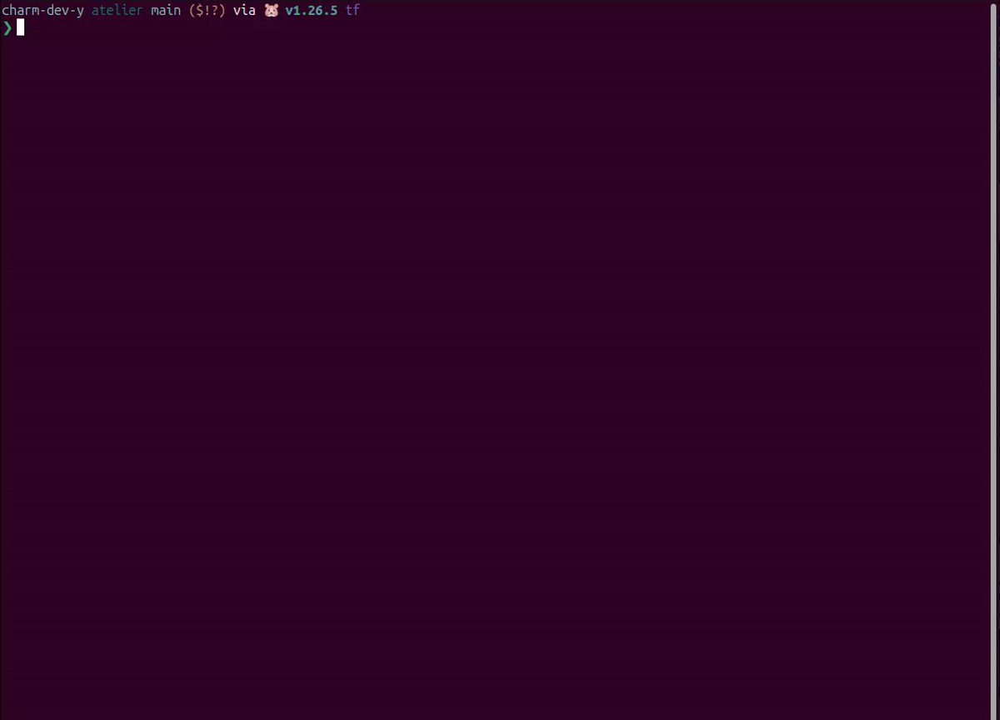
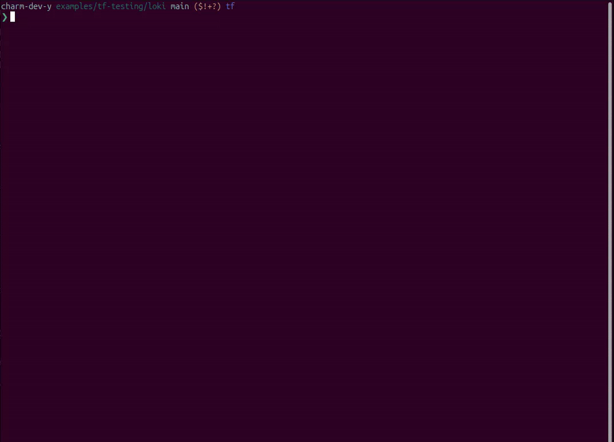
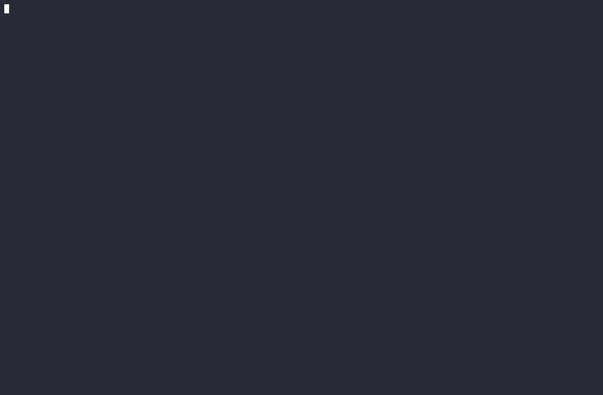
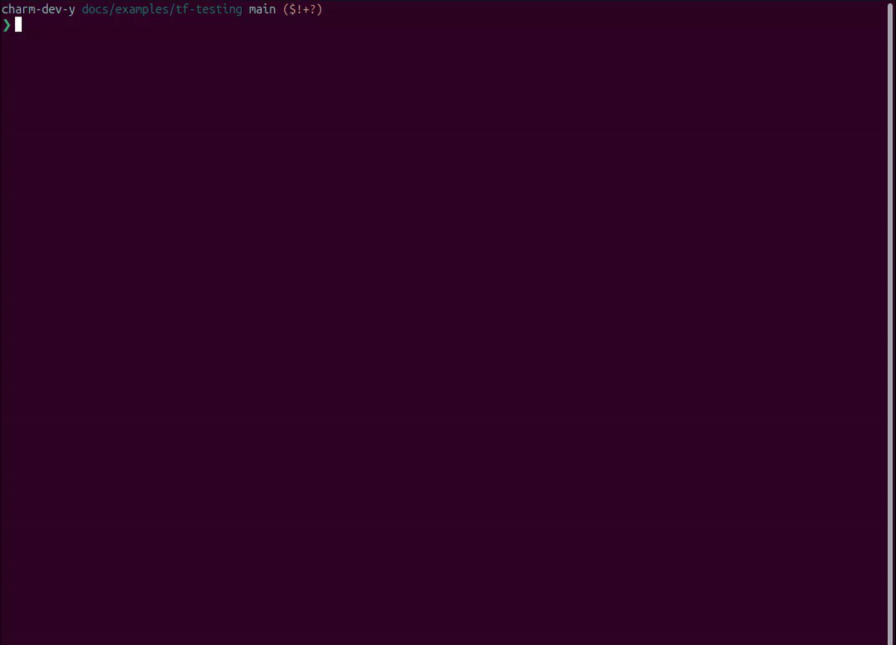
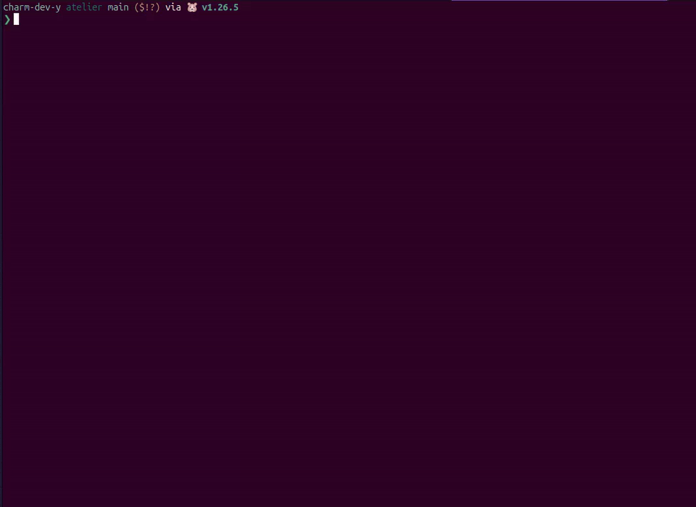
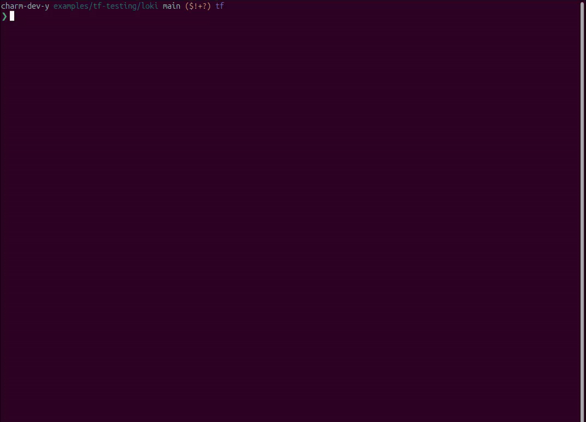

# Atelier

A terminal UI for deploying Terraform modules.

Point it at any git repo containing a Terraform module. Atelier asks you for the
values the module needs, then writes a small `main.tf` you can run like any
other Terraform configuration:

```hcl
module "cos_lite" {
  source = "git::https://github.com/canonical/observability-stack.git//terraform/cos-lite?ref=main"
  model  = { name = "cos-lite" }
}
```

Only the values you chose appear — everything else uses the module's defaults.
You get a browsable variable list, plan and apply without leaving the terminal,
and presets for reusable configurations.

## Design intent

- **Generic.** Works with any Terraform provider and any Terraform module that
  declares variables, not just Canonical products.
- **Wrapper-as-artifact.** The directory Atelier writes is the durable output.
  It is version-controllable, shareable, runnable without Atelier installed, and
  CI-compatible. Atelier's internal state lives in a `.atelier/` subdirectory
  that is regenerable from the wrapper.
- **Plan and apply in the TUI.** Atelier owns the configure → plan iteration
  loop and supports `terraform apply` from the plan view (`A` key).
- **Presets are plain Terraform.** Reusable value bundles are `.tfvars` files,
  discovered from an `atelier.presets/` directory or committed by the module
  under `<module>/presets/`. See [Presets](#presets).

## Requirements

- [Terraform](https://developer.hashicorp.com/terraform/install) (or OpenTofu)
  on your `PATH`.
- `git` on your `PATH` (Atelier shells out to it for cloning).

## Install

### Prebuilt binary (recommended)

Download the archive matching your OS and CPU, extract it, and move the
`atelier` binary onto your `PATH`:

```bash
VERSION=$(curl -sSf https://api.github.com/repos/MichaelThamm/atelier/releases/latest | grep '"tag_name"' | cut -d '"' -f 4) \
OS=linux \
ARCH=amd64 \
curl -sSfL \
  "https://github.com/MichaelThamm/atelier/releases/download/${VERSION}/atelier_${VERSION#v}_${OS}_${ARCH}.tar.gz" \
  | tar -xz atelier \
  && sudo install atelier /usr/local/bin/atelier
```

Builds are published for Linux, macOS, and Windows on amd64 and arm64;
`checksums.txt` accompanies each release.

### With Go

```bash
# Requires Go >= 1.25:
go install github.com/MichaelThamm/atelier/cmd/atelier@latest
```

## Quick start

Start a new wrapper from any public git repo containing Terraform modules.
`atelier add` bootstraps the wrapper on first use, creating a directory named
after the module. This example uses COS Lite (`canonical/observability-stack`):

```bash
atelier add \
  https://github.com/canonical/observability-stack.git \
  --module terraform/cos-lite < /dev/null
cd cos-lite
```

Redirecting stdin (`< /dev/null`) skips the TUI, so the command works unattended
in scripts and CI. Without it, `atelier add` opens the TUI, where you review the
module's variables and fill in any it requires.

What Atelier wrote is a normal Terraform project — Atelier is not needed to run
it:

```bash
terraform init && terraform apply
```

COS Lite's providers are Juju, so its `plan` and `apply` need a Juju controller
on Canonical K8s; for a module whose providers you already have credentials for,
the same two commands run it. [Presets](#presets) seed values from a named
`.tfvars` bundle instead of the defaults.

The same flow works for any module — for example
[`terraform-aws-modules/terraform-aws-vpc`](https://github.com/terraform-aws-modules/terraform-aws-vpc):

```bash
atelier add https://github.com/terraform-aws-modules/terraform-aws-vpc.git
```

`atelier add` creates a directory named after the module candidate (here
`cos-lite`) unless `--dir`/`--as` names one, so there is no `mkdir`/`cd` to do
first. When the target — `--dir`, else the current directory — already holds a
wrapper, it appends a module block instead; when it creates its own directory, a
non-empty target is refused rather than scaffolded over
([ADR-0030](docs/adr/0030-target-directory-preflight.md),
[ADR-0034](docs/adr/0034-module-apply-one-liner.md)). Run `atelier wrappers` to
list the wrappers sharing a parent directory (e.g. a `tf-testing/` scratch
dir).

### Compose several modules

Because `--dir` names the wrapper to compose into, a deployment of several
modules is one command per module, and they all land in the same root — one
`terraform init`, one state, one `apply`:

```bash
atelier add cos-lite                          # scaffolds ./cos-lite/
atelier add charmed-spark --dir cos-lite      # composes into it
```

`atelier apply` follows the same rule, and deploys the composed root:

```bash
atelier apply charmed-spark --dir cos-lite
```

The TUI groups each module's variables under its own header and switches the
ref, plan, and apply target to whichever one you are on, so a multi-module
wrapper is edited as one document. Modules are ordinary Terraform blocks, so
wire one module's output into another's input the way you would by hand —
`greeting = module.cos_lite.greeting`. See
[ADR-0042](docs/adr/0042-dir-names-the-wrapper.md).

### Just apply it

For the common "I only want this module running" case, `atelier apply` does the
`mkdir && cd` and the `terraform init && terraform apply` for you: it creates a
directory named after the module, writes the wrapper, initialises it, and runs
`terraform apply`.

```bash
atelier apply \
  https://github.com/canonical/observability-stack.git \
  --module terraform/cos-lite --var model_uuid=<MODEL_UUID>
```

At a terminal it uses Terraform's **interactive** apply, so you review the plan
and confirm it at Terraform's own prompt (there is no `--yes`). With no terminal
— a script, CI, or `… < /dev/null` — it applies with `-auto-approve` instead, so
the same command runs unattended. `atelier apply <git-url>` is an alias. The
directory is named after the module (`cos-lite` above); `--as`/`--dir` override
it, and a non-empty target with no `main.tf` is refused rather than scaffolded
over. A `--dir` (or CWD) that already holds a wrapper composes into it instead —
see [Compose several modules](#compose-several-modules). The result is an
ordinary wrapper — `cd` into it and run `atelier` to configure further, or
`terraform` directly. See [ADR-0034](docs/adr/0034-module-apply-one-liner.md).

Re-open an existing wrapper (run with no arguments in the wrapper dir):
```bash
atelier
```

> **Note:** run `atelier --help` for the full command list, including `atelier
> add|rm|ls`, `atelier wrappers`, `atelier tidy`, and `atelier purge`.

> **Note:** the demos below use
> [loki-operators](https://github.com/canonical/loki-operators/tree/main/terraform):
> its module has many inputs, so it shows the variable list well.

<details>
<summary>Demo: adding a module</summary>

1. `atelier add https://github.com/canonical/loki-operators.git`
2. Browse the module's variables



</details>

<details>
<summary>Demo: plan a module deployment</summary>

1. `atelier`
2. Press `[P]` to begin the plan
3. Investigate the Terraform state changes
4. Optionally press `[A]` to apply the state



</details>

## Presets

A preset is a named `.tfvars` file: a bundle of variable values you apply in
one action, then customise. Atelier finds them in two places:

- **Personal** bundles in an `atelier.presets/` directory, searched from the
  wrapper directory upwards (nearest wins), so one directory can serve several
  wrappers.
- **Product** presets committed to the module repo, e.g.
  `terraform/cos/presets/single-unit.tfvars`.

Atelier reads only Terraform-native `.tfvars` files, and only when you name
them. See [ADR-0031](docs/adr/0031-presets-as-tfvars-bundles.md).

Atelier also bundles a gallery of quick starts for real modules. Run `atelier
gallery list` to see each module, its pinned ref, the presets it composes (if
any), and the command to deploy it. An entry also lists the inputs it leaves to
you, so you see them before running. `atelier gallery lint` checks that every
entry covers the required inputs its module declares. See
[ADR-0035](docs/adr/0035-bundled-module-gallery.md) and
[ADR-0039](docs/adr/0039-composed-gallery-presets.md).

The TUI lists both sources with `F` (source-labelled `[local]`/`[repo]`, with
the description taken from each file's leading comment); `Enter` applies the
selected one. Press `S` to save the current non-default configuration as a new
`atelier.presets/<name>.tfvars` in the wrapper directory.

### Applying a preset from the CLI

`atelier add` accepts `--var-file`, which seeds a wrapper from one or
more bundles. Redirecting stdin (`< /dev/null`) skips the TUI, so it runs
unattended in scripts and CI. Comma-separate several bundles, or repeat the
flag; later files win.

```bash
atelier add https://github.com/canonical/observability-stack.git \
  --module terraform/cos \
  --var-file single-unit,no-ingress,s3-seaweedfs < /dev/null
cd cos
```

`--var` sets a single input directly and wins over any `--var-file`:

```bash
atelier add https://github.com/canonical/observability-stack.git \
  --module terraform/cos-lite \
  --var-file no-ingress \
  --var 'model={uuid="<MODEL_UUID>"}' < /dev/null
```

For an object value, `--var` deep-merges over what the bundles set, so
unmentioned fields are preserved:
`--var-file no-ingress --var 'ingress={alertmanager=true}'` keeps every other
component off and turns only Alertmanager ingress back on.

Names resolve against your walk-up `atelier.presets/` bundles first, then the
module repo's presets; a local path is also accepted. `--list-var-files` prints
what is available:

```bash
atelier add https://github.com/canonical/observability-stack.git \
  --module terraform/cos --list-var-files
```

```text
[repo] no-ingress               terraform/cos/presets/no-ingress.tfvars
[repo] s3-seaweedfs             terraform/cos/presets/s3-seaweedfs.tfvars
[repo] single-unit              terraform/cos/presets/single-unit.tfvars
```

Redirecting stdin (`< /dev/null`) makes these examples non-interactive, so they
run unattended. When `atelier add` creates its own directory there is no prompt;
`--yes` is for the additive case, where the current directory already holds
files but no wrapper and Atelier asks before appending a module block
([ADR-0030](docs/adr/0030-target-directory-preflight.md)). Without a terminal on
stdin the preflight fails, naming `--yes`.

<details>
<summary>Demo: saving a preset</summary>

1. `atelier`
2. Fill in all the required variables
3. Press `[S]` to save an `atelier.presets/<name>.tfvars` bundle



</details>

<details>
<summary>Demo: applying a preset</summary>

1. `atelier`
2. `[F]` to select and apply a bundle from a parent directory



</details>

## Importing live infrastructure

`atelier import` reconstructs Terraform state for an existing module from a
running deployment. It discovers live resources via `terraform query`, matches
them to the module's resource addresses, and runs `terraform import` for each
match — a state-only operation that cannot change your infrastructure. Use
`--dry-run` to review what would be imported, and what the module would still
create, without touching state. See
[docs/how-to/import-juju.md](docs/how-to/import-juju.md) for a step-by-step Juju
walkthrough.

<details>
<summary>Demo: importing a live deployment</summary>

1. `atelier import`
2. `atelier`



</details>

### From bundle to import

Product modules ship **preset bundles** — plain `.tfvars` files committed under
`<module>/presets/` — and `--var-file` applies them by name. Combined with
`atelier import`, the same bundles that seed a fresh deployment also reconstruct
its state, so a known-good shape is one line in a script.

See what the module offers:

```bash
atelier add https://github.com/canonical/observability-stack.git \
  --module terraform/cos-lite --list-var-files
```

**Create a wrapper from presets:**

```bash
atelier add \
  https://github.com/canonical/observability-stack.git \
  --module terraform/cos-lite \
  --var-file no-ingress < /dev/null
```

**Import an existing deployment into that shape:**

```bash
mkdir cos-lite-import && cd cos-lite-import
atelier import juju \
  --source https://github.com/canonical/observability-stack.git \
  --module terraform/cos-lite \
  --var-file no-ingress \
  --var 'model={uuid="<MODEL_UUID>"}' \
  --query-var model_uuid=<MODEL_UUID>
```

The pieces that make this work:

- **`--var-file a,b,c`** applies several bundles at once; later files win.
- **`--var`** sets a single input and wins over any bundle. A structured value
  is one flag with an HCL expression, e.g. `--var 'model={uuid="…"}'`.
- **`--query-var model_uuid`** is required by the Juju provider's list
  resources; `--var model` pins the module's own model input.
- **`--list-var-files`** works on both `atelier add` and `import` (the latter
  needs `--source`, since the repo is only searched after a clone).

## Comparing versions

Press `R` to switch the module ref without leaving the TUI. Atelier
re-clones the module, carries your values forward, runs
`terraform init -upgrade`, and flags any orphaned or newly required
variables.

The ref field filters the remote's branches and tags as you type, so a big
repo's 50-plus refs narrow to the few you mean. Free text (an arbitrary SHA, an
unlisted ref) is always accepted. Press `?` in the modal for its navigation
keys.

<details>
<summary>Demo: switch module ref</summary>

1. `atelier`
2. `[R]` to browse module refs
3. Apply and inspect module changes with `[D]`



</details>

## Keyboard shortcuts

`Tab` moves between the variable list and the editor, `↑`/`↓` (or `j`/`k`) move
the selection, and `Enter` opens or advances. Value fields share a readline-style
keymap (`Ctrl+A`/`Ctrl+E`, `Ctrl+W`, `Alt+B`/`Alt+F`, …), so editing feels like
`bash`.

Press `?` anywhere for the complete, context-aware keymap — it lists the keys for
the view you are in and is the single source of truth for shortcuts. The demo
GIFs in the feature sections show each flow end to end.

## Validate on save

Every edit is saved to disk immediately, and Atelier runs a background
`terraform validate`. Errors appear inline in the status bar; press `L` for the
live logs, whose Errors tab holds the full diagnostics. Validation runs
`terraform init` automatically if the workspace isn't initialised yet.

## Tidying a wrapper

Atelier writes sparse `main.tf` files — only values that differ from the
module's defaults appear (see [ADR-0007](docs/adr/0007-sparse-wrapper-write-rule.md)).
But a wrapper that was hand-authored or seeded from an upstream example often
carries arguments set to their default value, which is just noise:

```hcl
module "cos_lite" {
  source  = "git::https://github.com/canonical/observability-stack.git//terraform/cos-lite?ref=main"
  model   = { name = "cos-lite-two" }
  grafana = { units = 1 }          # 1 is already the default
  catalogue = { app_name = "catalogue" }  # also the default
}
```

`atelier tidy` prunes those redundant arguments back to sparse form:

```bash
atelier tidy            # dry run: print the diff, change nothing
atelier tidy --write    # apply it (backs up main.tf first)
```

It is **dry-run by default**. With `--write` it copies the current `main.tf`
to `.atelier/backups/main.tf.<timestamp>.bak` before rewriting. Tidy reuses
the same writer the TUI uses, so the change is apply-neutral: `terraform plan`
is identical before and after. Arguments whose value is an expression
(`var.x`, `module.y.z`) are never pruned. See
[ADR-0021](docs/adr/0021-tidy-command.md) for the design.

## Troubleshooting

Atelier persists terraform's diagnostics under the wrapper's
`.atelier/logs/` directory (gitignored, regenerable). The `L` logs view prints
this directory's absolute path at the top, along with the files that actually
exist there, so you can open them from a shell without guessing where the
wrapper lives:

- `tf-stderr.log` — terraform's stderr, appended across runs. Always on. It
  stays small because successful commands write little to stderr, so it
  mostly captures the warnings and errors worth keeping. This is the first
  place to look after an intermittent `plan`/`apply` failure.
- `tf-stdout.log` — terraform's stdout (plan/apply progress), appended across
  runs. Always on. This is the on-disk counterpart to the logs view's Logs tab.
- `tf-trace.log` — terraform's full `TRACE` log, written only when the
  `ATELIER_DEBUG` environment variable is set to a truthy value
  (`ATELIER_DEBUG=1 atelier`). It is verbose, so it is off by default; leave
  it enabled to capture the exact `git` commands terraform's module
  installer runs — useful for diagnosing flaky `terraform init` module
  fetches.

## Documentation

| Document | Description |
| --- | --- |
| [Project website](https://michaelthamm.github.io/atelier/) | Landing page and the generated module gallery |
| [docs/SPEC.md](docs/SPEC.md) | Specification: surface, contracts, behaviours |
| [docs/ROADMAP.md](docs/ROADMAP.md) | What Atelier does today and what's not yet implemented |
| [docs/how-to/](docs/how-to/) | Step-by-step guides |
| [docs/adr/](docs/adr/) | Architecture Decision Records |
| [docs/examples/](docs/examples/) | Sample preset bundles (`atelier.presets/`) |

## Testing

The development loop is three commands:

```bash
# ...edit code...
just install    # build and install the binary into $GOBIN
just test       # run the unit suite with the race detector
```

Other useful recipes (`just --list` shows all):

- `just check` — the full gate CI runs: format check, build, vet, and `just test`.
- `just test-pkg ./internal/tui` — unit tests for one package.
- `just build-bin` — build the dev binary at the repo root, which the
  integration tiers use.
- `just test-integration` — the fast integration tier; needs only Terraform and
  `git`, no Juju model.

The `cloud`-marked integration tiers need Juju + Canonical K8s (prepared by
Concierge); see [tests/integration/README.md](tests/integration/README.md) to run
them locally.

- `just test-prometheus` — deploys
  [`canonical/prometheus-k8s-operator`](https://github.com/canonical/prometheus-k8s-operator)
  as a deployment smoke test.
- `just test-import` — COS-Lite
  ([`canonical/observability-stack`](https://github.com/canonical/observability-stack))
  import round-trip: it deletes the Terraform state and proves `atelier import`
  rebuilds it.
- `just test-cloud` — both of the above.

## License

Apache-2.0. See [LICENSE](LICENSE).
